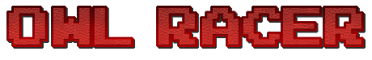
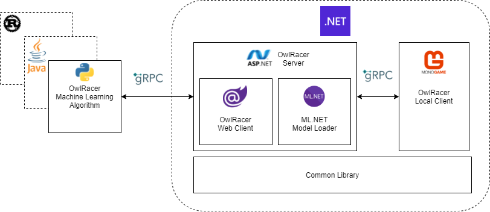

# Matlabs OwlRacer

  ## Get Conected

  

  

  

  

____

____

## Table of Contents

* [Introduction](#introduction)
* [Architecture](#architecture)
  * [Server](#server)
  * [Common Library](#common-library)  
  * [Local Client](#local-client)  
  * [Web Client](#web-client)
  * [Machine Learning Algorithm](#machine-learning-algorithm)
  * [ML.NET Model Loader](#ml.net-model-loader)
* [SDK](#sdk)
* [Setup for local development](#setup-for-local-development)
  * [.NET Projects](#.net-projects)
  * [Machine Learning Samples](#machine-learning-samples)

## Introduction

This repository serves as the Head for the Matlabs OwlRacer AI project. The goal of this project is to play around and work with a AI using a simple racing game framework. It is intented for students, colleagues and enthusiasts who want to get started with machine learning or try out their own models.

## Architecture

The OwlRacer project consists of two major parts: First is the Server, whose purpose is to control all the aspects of the racing game without actually providing an UI. It holds all the required information, about the track, the race cars, in which direction they are driving etc. Further there is a dedicated UI implementation in Monogame. Then there are 'Clients' which can be used to control the cars on the Server by sending commands like "Please rotate the car now" or querying data like "How far is it to the next wall on my righthand-side?".

The communication between Server and Clients is realized using (Web-)gRPC which allows fast IPC (Inter-Process-Communication) between process- and machine boundaries. This way, the Server can run on a separate and faster machine, serving multiple clients at once. The Client on the other hand can virtually be anything (gRPC/protobuf is supported on a good amount of platforms and languages). This repository contains a UI Client to enable the user to 'see' what is actually happening with his Car on the client and even control it with the cursor keys.

Usually Clients want to be more low-key though, like console-based AI trainers written in Python e.g. Check the [MATHEMA GitHub](https://github.com/MATHEMA-GmbH) for more supported languages.

To support pre-computed machine learning models the clients maintained by MATHEMA provide ONNX interfaces. 

### Server

The Server is the central part of the project, calculating the outcome of the commands sent by the clients, keeping everything synchronized and providing services for controlling the racing game overall. The communication between the Server and Clients is performed using (Web-)gRPC.

For more information on the component, [visit its documentation here](src/Matlabs.OwlRacer.Server/README.md).

The Server itself is ASP.NET Core based, which means it is able to host the Web-Client directly within its process space (see Web-Client below).

The Server also contains some sub-components:

### Common Library

The common library contains shared models and classes for easier data exchange between the Local Client and the Server projects, as they reside within the same Visual Studio solution. This project is built and used by the other .NET projects directly and does not require additional documentation.

### Local Client

The UI client is a visual test and sandbox client implemented with the MonoGame Framework. MonoGame is based on Microsofts XNA Framework and enables fast and lightweight 2D rendering perfectly suited for the purpose of showing the user what is going on during machine learning. It also enables the users to drive a car themselves and even compete against AI.

Note however, that the UI client is merely a tool to give developers a visual representation to make analysis easier (ok, and to incorporate some fun into the project ^^). The main focus still relies on the machine learning clients doing the actually interesting stuff.

The communication between the UI client and the server is realized using a (Web-)gRPC channel.

For more information on the component, [visit its documentation here](src/Matlabs.OwlRacer.GameClient/README.md).

#### Machine Learning Algorithm

This component represents virtually any Client that connects to the Server via (Web-)gRPC with the intent to train an AI model to drive the car around the track.

Any language and implementation can be used that supports gRPC and allows nearly any developer interested in machine learning to start implementing their own algorithms.

Currently there are sample algorithms available, written in Python.

For more information on the component, [visit its documentation here](src/PythonSamples/README.md).

#### ML.NET Model Loader

The ML.NET Model Loader is capable of loading previously created AI models into the Server and executing them directly. The component is still in the early stages of development, so no documentation or direct implenentation is yet available.

### Setup for local development

If you want to develop directly on the project, the following requirements must be met.

#### .NET Projects

The .NET projects include the Server, the Common Library, the UI client and the ML.NET model loader
* .NET 5 SDK or later (Server, UI Client, Common Librarys)
* .NET 3 Framework (for UI Client)
* Visual Studio 2019 or later
* A [protobuf compiler](https://developers.google.com/protocol-buffers) (can be installed with Visual Studio)

The main Visual Studio solution containing the project you need will be build with the setup.sh

When all requirements above are met, the solution should build without any further setup or problems.

There are currently two standard configurations for the solution, **DEBUG** and **RELEASE**. Apart from some more verbose console output and the usual facts about **DEBUG** and **RELEASE** builds, the configuration you use will not matter that much at the moment.

When starting the projects, the Server should always be started first, for any other Client you want to use. It is recommended to setup multiple startup-projecsts in the solution settings, having the Server start before the Client, to make things easier.
